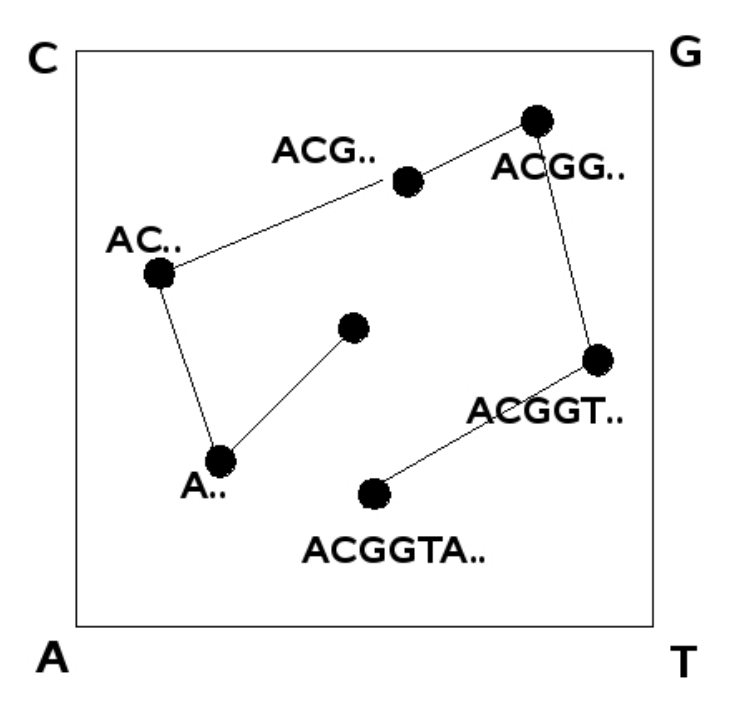
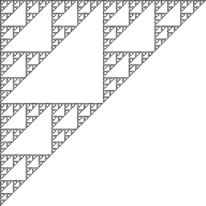
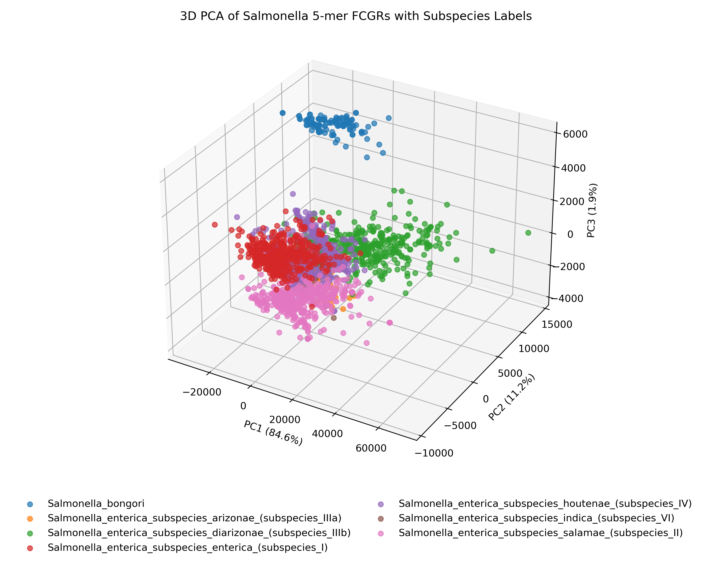
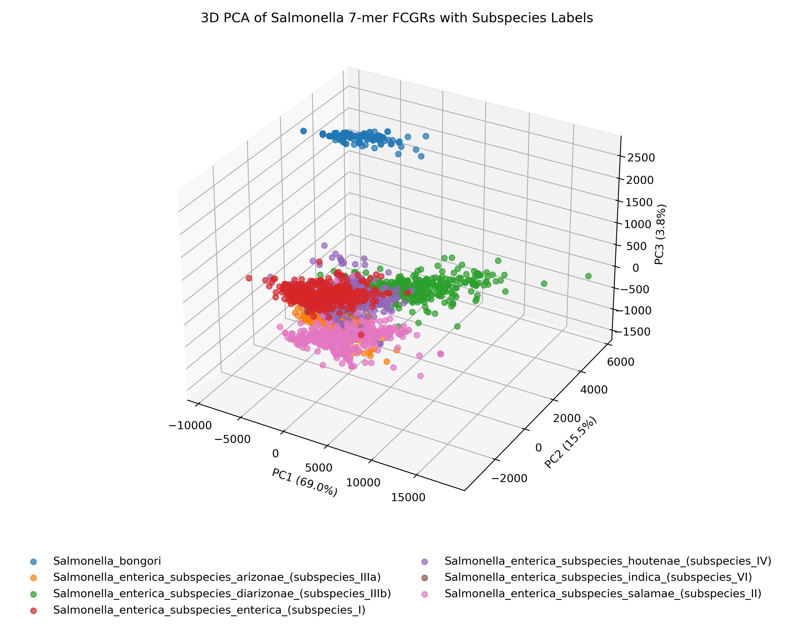
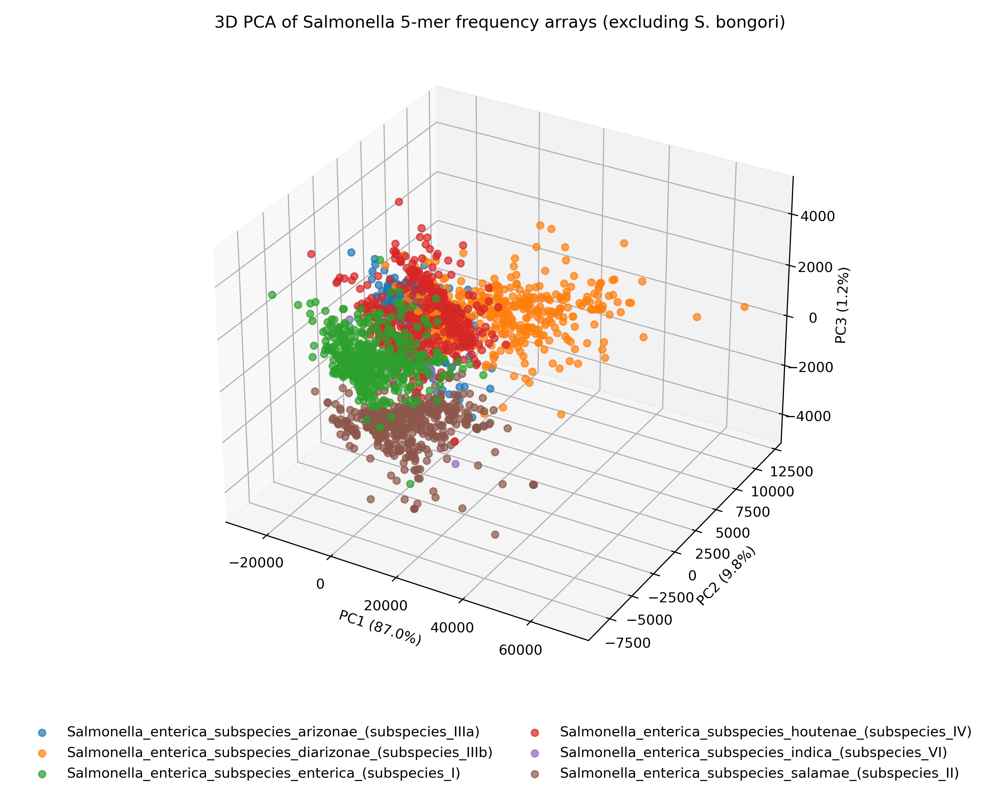
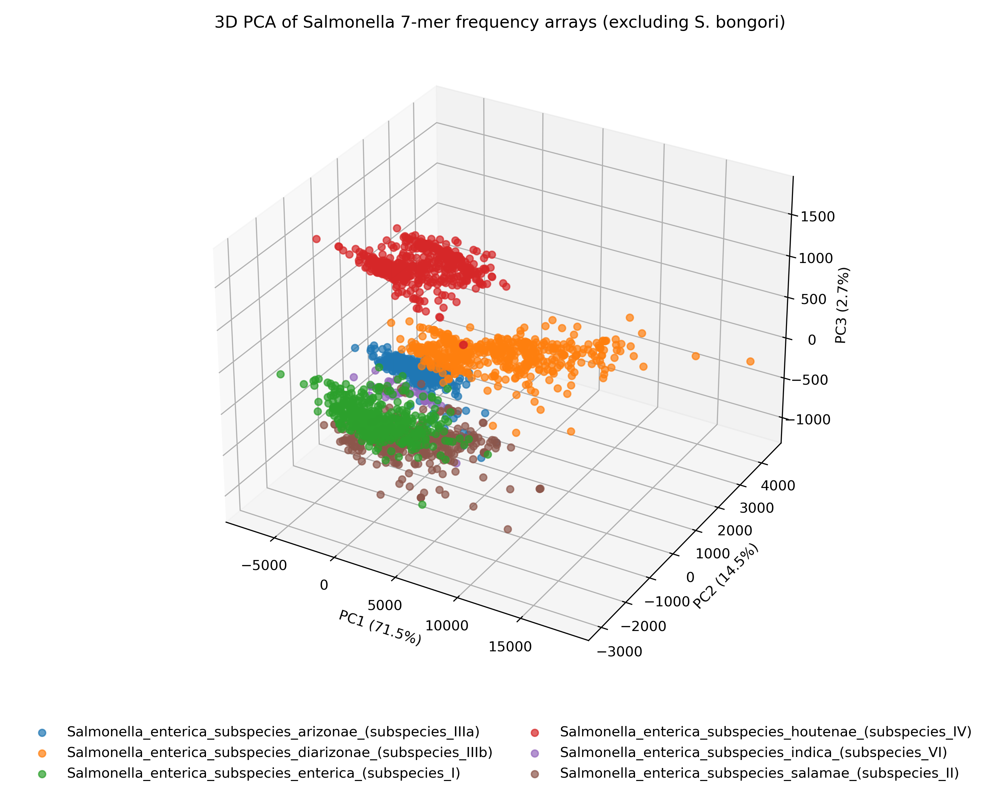
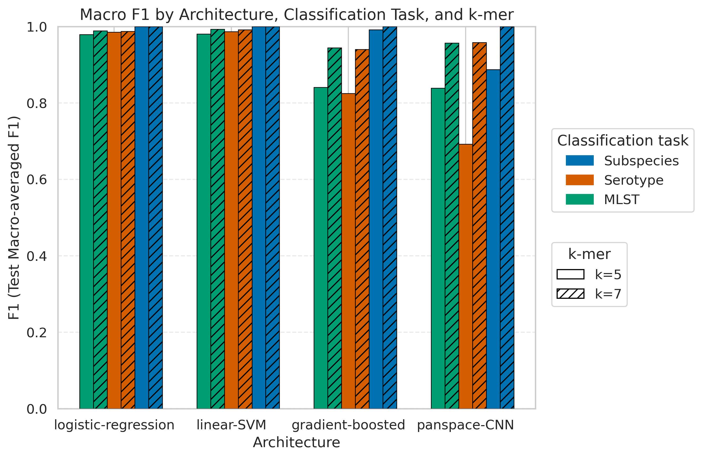
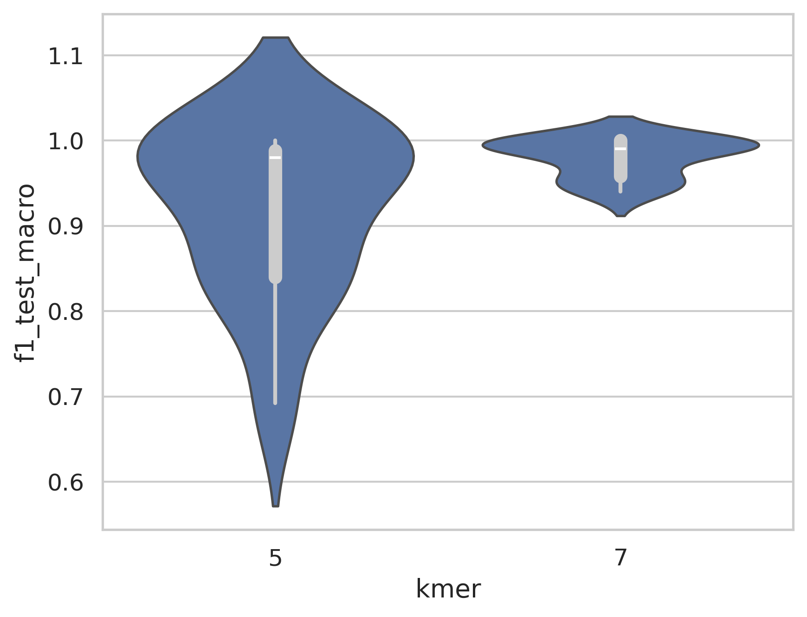
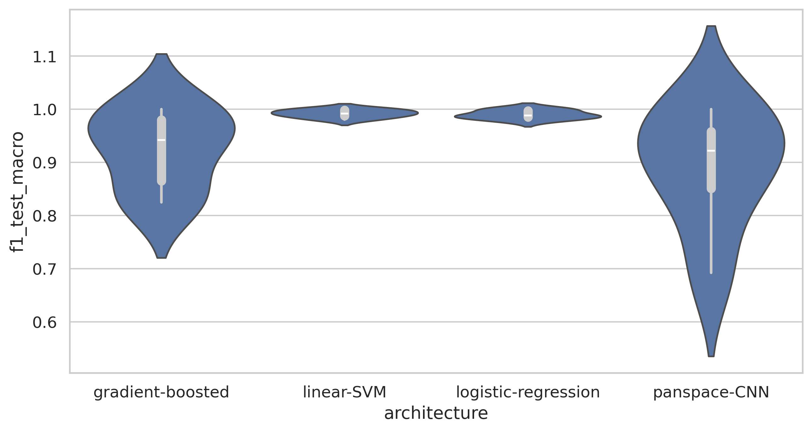

# Simple Linear Models Using Frequency Chaos Game Representations Achieve High Accuracy in Low-Level Taxonomic Classification of *Salmonelleae*

*Final Project for Machine Learning in Computational Biology CX4803-MLB at Georgia Institute of Technology*, Spring 2025

### Author: Ethan Hetrick

## Abstract

As Next-Generation Sequencing data continues to grow at an exponential rate, scalable methods for genome comparison are in high-demand. For example, public health surveillance and environmental monitoring laboratories routinely query large sequence database for organism identification. However, traditional sequence alignment algorithms have become infeasible for querying at the current scale. Consequently, alignment-free sequence identification methods have gained traction in recent years. However, the heuristic methods which improve scalability typically lack high-resolution at low taxonmic levels (e.g. subspecies, strain), and still often run into scaling issues given their underlying data structures and algorithm time-complexity. Here, I apply **Frequency Chaos Game Representations (FCGRs)** to encode genome assembly *k-mer* counts into compact 2D matrices, providing light-weight genome representations which capture broad evolutionary trends. Using *Salmonella sp.* as a model organism, I demonstrate that simple machine learning algorithms can accurately predict subspecies and strain-level classifcations from FCGR-encoded genomes at scale.

## Introduction

Historically, *Salmonella enterica* have been subtyped using a variety of *in vitro* methods including, but not limited to, biochemical, antisera agglutination, phage plaque, and PCR assays using subtype-specific primers. With the advent of Next-Generation Sequencing, laboratories have started to transition to *in silico* methods for subtyping. Most of these methods use some sort of sequence alignment algorithm to known references. These typically include high-quality genome references, alleles, or antigen encoding genes. For species-level, and more recently, subspecies-level identification, Average Nucleotide Identity (ANI) thresholds of 95% and 98%, respectively, are routinely used (Pearce et. al, 2021). These methods have considerable limitations, including sensitivity to small mutations in target genes, high reliance on manually curated references, often requiring high-throughput sequencing (>20x), generates a need to continuously update schemes as new subtypes are discovered, requires expensive and hard to maintain laboratory reagents, performs poorly on out of distribution data, etc. Clearly, a sequence-agnostic method that does not rely on expensive laboratory assays, ultra high-quality data, and is also highly-scalable is in great need.

Since it's advent in 1990 by Jeffrey and colleagues, Chaos Game Represenatation (CGR), a method used to transform biological sequence data into coordinates in N-dimensional space, has been used to classify biological sequences. Protein function prediction, gene annotation and taxonomic classication are a few of the applications that have been explored. Unfortunately, this method has not recieved much traction, having only 43 results appear in Google Scholar under the search term "chaos game representation" and only 991 citations to the original article 35 years ago. While these aren't terrible metrics, I believe the potential of this technique has not been fully actualized. While no current big name taxonomic classification tools use CGRs, I can find instances as early as Deschavanne et. al, 1999, showing their ability to capture genome wide patterns for species-level taxonomic classification.

CGRs for taxonomic classification almost all utilize DNA CGRs. DNA sequences of N-length are converted into 2D coordinates. Each of the four nucleotides (A, T, G and C) serve as the 4 corner coordinates of the initial CGR. Coordinates are derived from an iterative process of moving half-way between the current coordinate and one of the 4 corner coordinates, depending on the nucleotide at a given sequence index. Subsequently, this process creates fractal patterns. Frequency Chaos Game Represenation (FCGR) is a variation of CGR which bins coordinates in close proximity and combines the counts of all coordinates in he bin and expresses the sum of coordinates as one intensity value. FCGRs offer the additional dimiensionality of frequency alongside sequence composition, which captures more genomic context than CGRs alone. 

[a] [b]

> Figure 1: [a] Source: Neme et. al, 2008. Example of DNA sequence to CGR coordinate transformation. [b] FCGR of ranomly generated 8-mers lacking the nucleotide T, showcasing the fractal nature of this represenation.

| Organism | *k-mer=5* | *k-mer=7* |
| ---------------- | --------------------------- | ---------------- |
| *E. coli* strain K-12 |  |  |
| *S. enterica* serotype Typhimurium |  |  |

> Figure 2: Frequency Chaos Game Representations examples of *E. coli* and *S. enterica* genomes

The vast majority of recent methods for taxonomic classification using CGR/FCGRs typically focus on the use of convolutional neural networks (CNNs) to learn non-linear patterns to make predictions [see Table 1]. This is intuitive, as the image-like nature of the CGR begets a machine learning model designed for image processing. CNNs excel at learning complex, non-linear features from image data. However, it is my intuition that this level of model capacity is not required for accurate classification of CGRs. As DNA sequences always end up at the same coordinate, and similar sequences always land in a close-proximity in the coordinate space, standard image classification algorithms have too much model capacity than is needed. For example, the standard hand-written digit classification task requires a model to learn non-linear relationships between pixels and use kernel operations to classify, for example, the number 3 written by 100 different individuals with different styles. As sequences are always transposed to the same coordinate space, the features should be linearly correlated, making simpler algorithms such as a logistic regression or linear Support Vector Machine (SVM) a more appropriate choice. 

In this study, I benchmark a CNN architecture inspired by Cartes et. al 2025 (PanSpace) against models with decreasing levels of model capacity, including a gradient-boosted classifier, linear-SVM and logistic regression. I demonstrate the linearly-seperable quality of FCGRs, allowing for scalable and accurate prediction of *Salmonella spp.*, subspecies and strains using multiple gold-standard subtyping schemes.

| **Citation**                                                                                                                                                                                          | **Year** | **CGR Representation** | **ML Algorithm**                                                                                                           | **Task Performed**                                            | **Key Findings**                                                                                                                                                       |
| ----------------------------------------------------------------------------------------------------------------------------------------------------------------------------------------------------- | -------- | ---------------------- | -------------------------------------------------------------------------------------------------------------------------- | ------------------------------------------------------------- | ---------------------------------------------------------------------------------------------------------------------------------------------------------------------- |
| Cartes, Jorge Avila, *et al.* “PanSpace: Fast and Scalable Indexing for Massive Bacterial Databases.” *bioRxiv* (2025): 2025-03.                                                                      | 2025     | FCGR (k=6,7,8)         | CNN using *metric learning* — ensures same-label representations are close in embedding space; developed “convFCGR” layers | Taxonomic classification of genome assemblies                 | - Dense indexing enables large-scale searches    - Comparable species/genus-level accuracy to GSearch   - Outperforms ResNet50   - k=7 performed best         |
| Deschavanne, Patrick J., *et al.* “Genomic signature: characterization and classification of species assessed by chaos game representation of sequences.” *Mol. Biol. Evol.* 16.10 (1999): 1391–1399. | 1999     | CGR                    | N/A                                                                                                                        | Compared CGRs across major domains of life and within species | - CGR images from the same genome are more similar than those from different genomes   - Demonstrated feasibility of species identification from incomplete genomes |
| Alipour, Fatemeh, Kathleen A. Hill, and Lila Kari. “CGRclust: Chaos Game Representation for twin contrastive clustering of unlabelled DNA sequences.” *BMC Genomics* 25.1 (2024): 1–17.               | 2024     | FCGR                   | CNN with twin-contrastive learning                                                                                         | Unsupervised clustering of DNA sequences                      | - Accurate clustering across taxonomic levels   - Robust to unbalanced classes   - k=6 performed best                                                            |
| Abd-Alhalem, Samia M., *et al.* “Deep Learning Approach to Taxonomic Classification with CNN-ELM.” *ITC-Egypt* (2024).                                                                                | 2024     | FCGR (k=5,6,7)         | CNN with Extreme Learning Machine (ELM)                                                                                    | Genus-level taxonomic classification                          | - k=6 outperformed k=5 and matched k=7   - Achieved 98.5% accuracy for full genomes   - 81.2% for partial (500-bp) sequences                                     |
| Soliman, Naglaa, S. Abdelhaleem, and Walid El-Shafai. “Hybrid approach for taxonomic classification based on deep learning.” *Intelligent Automation and Soft Computing* 32 (2021): 1881–1891.        | 2021     | FCGR (k=6)             | Hybrid CNN + Wavelet Transform + BLSTM                                                                                     | Classification at multiple taxonomic levels                   | - Strong genus-level accuracy   - “W”-CNN model performed best at genus and family levels                                                                           |
| Zhou, Jiarui, *et al.* “PCVR: a pre-trained contextualized visual representation for DNA sequence classification.” *BMC Bioinformatics* 26.1 (2025): 1–24.                                            | 2025     | FCGR (k=4,5,6)         | Masked Autoencoder (MAE) + Vision Transformer (ViT)                                                                        | Multi-level taxonomic classification                          | - k=5 chosen for performance   - Outperforms other models at high taxonomic levels   - Underperforms at lower levels                                             |
| Millán Arias, Pablo, *et al.* “DeLUCS: Deep learning for unsupervised clustering of DNA sequences.” *PLoS One* 17.1 (2022): e0261531.                                                                 | 2022     | FCGR (k=6)             | Invariant Information Clustering (IIC), ANN                                                                                | Unsupervised classification at multiple taxonomic levels      | - Achieves higher accuracy than other unsupervised models                                                                                                              |
| Nanni, Loris, Daniela Cuza, and Sheryl Brahnam. “AI-Powered Biodiversity Assessment: Species Classification via DNA Barcoding and Deep Learning.” *Technologies* 12.12 (2024): 240.                   | 2024     | FCGR and others        | CNN + BLSTM (Attention)                                                                                                    | Multi-level sequence classification                           | - Benchmark comparison showed numerical encodings (e.g., FCGR) outperform other DNA representations                                                                    |

> Table 1: Summary of recent methods employing machine learning for taxonomic classification of CGRS and FCGRs.

## Methods

### Data Curation

All Salmonella genome assemblies available in NCBI’s RefSeq and GenBank collections as of May 30, 2025, were downloaded using the NCBI Datasets CLI tool. A total of 615,872 sequences were downloaded.

### Data Preprocessing

5-mer and 7-mer *k-mer* counts were generated using the kmc CLI tool (Deorowicz et. al, 2015). Duplicate genomes were randomly downsampled to a single representative if the 5-mer counts were exacty the same as determined by the md5 hashsum algorithm. Genome quality assessments were performed using the QUAST CLI tool (Gurevich et. al, 2013). Genomes with an N50 less than 5,000 basepairs were dropped. The SeqSero2 CLI tool (Zhang et. al, 2019) was used to call serotypes and subspecies, and the mlst CLI tool (<https://github.com/tseemann/mlst>) was used to call multi-locus sequence types. For each subset, genomes with null calls were dropped. A total of 368,778 and 308,053 genomes remained after filtering for the mlst and subspecies subsets, respectively.

For the serotype subset, only named *Salmonella enterica subspecies enterica* serotypes (e.g. Typhimurium) were kept for the serotype model. Named serotypes were chosen as all serotypes with proper nouns belong to *Salmonella enterica subsp. enterica* and all of them are recognized by the gold-standard Kauffman-White scheme for *Salmonella* serotypes (Kauffman et. al, 1961). This would automatically drop genomes which one or more of the antigen was not called due to somatic mutation or poor genome quality, which results in serotypes not being assigned their proper noun. A total of 243,668 genomes remained in the serotype subset after filtering.

*Salmonella bongori* was included in the subspecies subset as while it is it's own species, it is routine to screen against the five subspecies of *Salmonella enterica* along side *Salmonella bongori* in surveillance and monitoring of *Salmonella*.

In order to create balanced classes, all three subsets were randomly downsampled to 100 representatives per class, and classes with fewer than 100 representatives were droppped. The resulting subsets contained 232, 104, and 6 unique MLST, serotype, and subspecies classes, respectively. Each class was then randomly divided into training, validation, and test subsets using a 64/16/20 split. I chose an aggressive test split as redundancy at the strain and subspecies levels should reduce the need for a large training set, and the additional test data should lead to a more robust evaluation of model performance.

Data cleaning, including label preparation and formatting, was performed using a combination of the Pandas Python library and standard Unix CLI tools such as `awk` and `sed`.

### Architectures

My main objective was to benchmark the Panspace CNN against models of less model capacity. I chose logistic regression as it is the simplest multi-class classification algorithm, then a linear SVM, then a gradient-boosted classifier as each subsequent algorithm has incremental increases in model capacity. I used scikitlearn, xgboost, and pytorch libraries for the logistic regression and linear SVM, gradient-boosted classifier and Panspace CNN, respectively. Panspace's original CNN was used to make an embedding and was implemented in tensorflow. For this study, I modify only the encoder portion of their pipeline for classification. I also re-implemented it in PyTorch due to hardware and driver compatibility.

### Visualization

All plots were generated using either the Seaborn, matplotlib or complexCGR python libraries (<https://github.com/AlgoLab/complexCGR>).

### Performance Metrics

A macro-average of test set F1 scores were used for the bulk of performance evaluation of the various classification tasks and architectures. Macro-averaged F1 was chosen as each class was balanced, eliminating the need for micro-averaging or AUPRC. Additionally, macro-averaged F1 is a highly-interpretable metric for performance. An intentionally large test/training split of 20% was used to corroborate the validity of the results.

## Results

### Summary

To assess the linear seperability of the FCGRs, principal component analysis (PCA) was used to visualize whether subspecies formed distinct clusters [Figure 3]. PCA plots show coherent clustering for each of the subspecies, with improved seperability in *k-mer* length 7 and when *S. bongori* is removed. 

Across all classification tasks and *k-mer* lengths, the linear SVM achieved the highest overall performance. Logistic regression performed comparably to the linear-SVM [table 2]. Conversely, the gradient-boosted classifier and Panspace-CNN showed significantly lower performance, with the exception at the subspecies taxonomic level, where both performed comparably to the linear models [figure 4, figure 5b].

Performance generally improved with *k-mer*=7 compared to *k-mer*=5, particularly for higher-capacity models.

### Assessment of FCGR Linear Seperability

 

| Subset | *k-mer=5* | *k-mer=7* |
| ------ | --------- | --------- |
| 5 subspecies of *S. enterica* including *S. bongori* |  |  |
| 5 subspecies of *S. enterica* excluding *S. bongori* |  |  |

> Figure 3: PCA plots of 5-mer and 7-mer FCGRs of 5 *S. enterica* subspecies with and without *S. bongori*.

 

### Model Performance Evaluation

| Architecture        | **MLST**       | **Serotype**     | **Subspecies**  |
|----------------------|----------------|------------------|-----------------|
| Gradient-boosted     | 0.892 ± 0.073  | 0.882 ± 0.081    | 0.996 ± 0.006   |
| **Linear-SVM**       | **0.987 ± 0.009** | **0.989 ± 0.003** | **1.0 ± 0.0**   |
| Logistic-regression  | 0.984 ± 0.007  | 0.986 ± 0.002    | **1.0 ± 0.0**     |
| PanSpace-CNN         | 0.898 ± 0.084  | 0.825 ± 0.188    | 0.944 ± 0.080   |

> Table 2: F1 Test Macro (mean ± std) by Architecture and Dataset.

 

> Figure 4: Macro-averaged F1 score bar plot of four machine learning models labeled by classification task and *k-mer* length.

 

[a]  [b] 

> Figure 5: [a] Violin plot of 5-mer and 7-mer performance across all classification tasks and architectures. [b] Violin plot of architectures across all classification tasks and *k-mer* sizes.

## Discussion

Results from this analysis clearly show that the FCGR features are linearly correlated, and that high model capacity degrades performance for classification tasks, as non-linearity is not needed for accurate classification. This is a classic example of the bias-variance trade-off, demonstrating that high capacity models overfit to these linearly seperable data. The simple linear models I tested performed better than any of the models shown in Table 2 at low-level taxonomic classification. This is a crucial finding, as these linear models are lightweight, faster to train, and require much less computational power to perform. In fact, the above models were trained on a laptop GPU, demonstrating their ability to scale. The linear models are also much more interpretable for scientists, making them an appealing alternative to the higher-complexity models that dominate FCGR research.

*K-mer* counting is fast and requires very little computational resources, and the FCGR generation from the *k-mer* counts is trivial. The resulting FCGR matrix, stored as a NumPy array, is around ~100 kilobytes—approximately a 1,000-fold reduction in size compared to an average bacterial genome assembly gzipped FASTA file (~1 MB)—and offers even greater reduction potential for larger genomes. This vastly improves the portability of these datasets compared to standard genome formats. Recent research shows that taxonomic classification can be performed from FCGRs generated directly from sequencing reads, avoiding the need for genome assembly entirely and further reducing the computational requirements of taxonomic classification (de Medeiros et al., 2025). Building upon these benefits, Abd-Alhalem et al. (2024) achieved high accuracy in taxonomic classification using sequences as short as 500 base pairs, suggesting broad applications for low-throughput genome data and classification of metagenome-assembled genomes (MAGs).

The biological implications of these findings suggest that the frequency of short *k-mers* has sufficient resolution power to capture broad evolutionary trends even at low taxonomic levels, remaining robust across various definitions of a biological strain. The underlying biological basis of this relationship remains unclear, but I hypothesize that these *k-mer* lengths encode important genomic features such as codon bias, repetitive structures, and GC frequency, which appear to be species-specific. A widely used tool, JSpecies (Richter et. al, 2016), implements tetranucleotide frequencies as a method for taxonomic classification—another example of how frequencies of short genomic fragments encode a surprising amount of biological significance.

## Conclusion

As the amount of genomic data continues to increase, and as developing countries establish their own genomics infrastructure, it is crucial to create scalable, low-cost, and efficient models for multi-level taxonomic classification. This research has broad implications for public health, environmental monitoring, and genomics research. Given the extremely high-fidelity results of this study, greater attention should be directed toward these methods to further evaluate their potential use cases and applications.

## Future Direction

Further research is warranted to determine whether the findings of this study apply to other taxa and input data types (e.g., sequencing reads). Performance evaluations should be conducted before generalizing these results to different use cases. Future studies should prioritize the application of simple, linear models, as demonstrated here, rather than high-capacity models. Additional research is also needed to elucidate the underlying biological reasons why these simple *k-mer* representations capture broad evolutionary trends consistently across various subtyping methods.

An important next step is to identify which features are most important for taxonomic classification and why. Techniques such as Lasso and Ridge regression, along with the calculation of Shapley values, may provide valuable insights into assessing feature importance.

## Data availability

All necessary scripts and data to recreate this study is available at this GitHub repo <https://github.com/Ethan-Hetrick/FCGR_classifier/tree/main>.

## Contributions

Thanks to my partner and colleague Kathryn Morin for late night hack-a-thons on some of the CNN code, discussing this project *ad nauseam* with me, and allowing me use her nice laptop for the analysis.

## Citations

Kauffman, F. (1961). Bacteriology of Salmonella Species.

Jeffrey, H. J. (1990). Chaos game representation of gene structure. Nucleic Acids Research, 18(8), 2163–2170.

Deschavanne, P. J., Giron, A., Vilain, J., Fagot, G., & Fertil, B. (1999). Genomic signature: characterization and classification of species assessed by chaos game representation of sequences. Molecular Biology and Evolution, 16(10), 1391–1399.

Neme, A., Nido, A., Mireles, V., & Miramontes, P. (2008). The self-organized chaos game representation for genomic signatures analysis. Learning Nonlinear Models, 6(2), 111–120.

Gurevich, A., Saveliev, V., Vyahhi, N., & Tesler, G. (2013). QUAST: quality assessment tool for genome assemblies. Bioinformatics, 29(8), 1072–1075.

Deorowicz, S., Kokot, M., Grabowski, S., & Debudaj-Grabysz, A. (2015). KMC 2: fast and resource-frugal k-mer counting. Bioinformatics, 31(10), 1569–1576.

Michael Richter, Ramon Rosselló-Móra, Frank Oliver Glöckner, Jörg Peplies, JSpeciesWS: a web server for prokaryotic species circumscription based on pairwise genome comparison, Bioinformatics, Volume 32, Issue 6, March 2016, Pages 929–931, https://doi.org/10.1093/bioinformatics/btv681 

Zhang, S., Den Bakker, H. C., Li, S., Chen, J., Dinsmore, B. A., Lane, C., ... & Deng, X. (2019). SeqSero2: rapid and improved Salmonella serotype determination using whole-genome sequencing data. Applied and Environmental Microbiology, 85(23), e01746–19.

Pearce, M. E., Langridge, G. C., Lauer, A. C., Grant, K., Maiden, M. C., & Chattaway, M. A. (2021). An evaluation of the species and subspecies of the genus Salmonella with whole genome sequence data: Proposal of type strains and epithets for novel S. enterica subspecies VII, VIII, IX, X and XI. Genomics, 113(5), 3152–3162.

OpenAI. (2023). ChatGPT (Mar 14 version) [Large language model].

Abd-Alhalem, S. M., et al. (2024). Deep learning approach to taxonomic classification with CNN-ELM. ITC-Egypt.

de Medeiros, B. A., Cai, L., Flynn, P. J., Yan, Y., Duan, X., Marinho, L. C., ... & Davis, C. C. (2025). A composite universal DNA signature for the Tree of Life. Nature Ecology & Evolution, 1–15.

Cartes, J. A., et al. (2025). PanSpace: Fast and scalable indexing for massive bacterial databases. bioRxiv, 2025–03.

### Statement on the Use of Generative AI

ChatGPT was used for some basic code syntax, code debugging and file formatting tasks. All ideas, writing and analyses were done without the use of generative AI.
